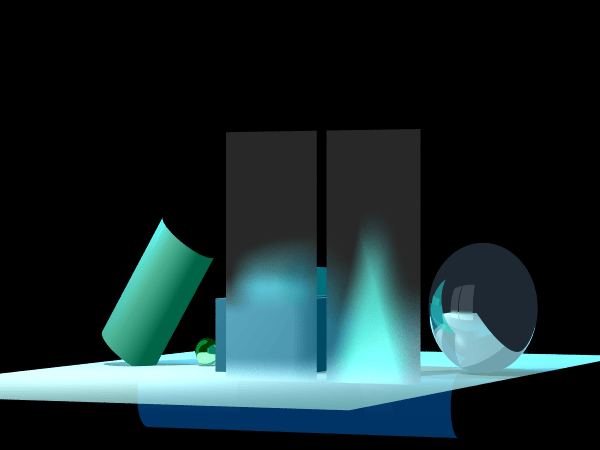

# Project_151055
As part of the course "Introduction to Software Engineering",
we designed and model a virtual 3-dimensional graphical scene.   
a complete system that includes all the elements and physics involved: 
color, rays, geometries, light source, occlusions, shadows, reflections, refractions, transparency, camera, etc.    
Improving performance by multi-threads and adaptive grid, applying development principles like  TDD, Refactoring, agile methodologies, and more.

 

